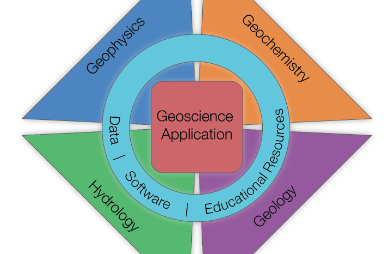

# Impacts of magnetic permeability on electromagnetic data collected in settings with steel-cased wells

_Lindsey J. Heagy and Douglas W. Oldenburg_

[https://doi.org/10.1190/tle43020084.1](https://doi.org/10.1190/tle43020084.1)



## Summary 

This article considers the potential for open-source software and open-science practices to accelerate research in applied geophysics and thereby contribute to solutions of geoscientific problems impacting society. We provide context on the definition of open-source and give a brief history of open-source software in applied geophysics. Drawing from our experience in the SimPEG project, which develops software for simulation and inversion of geophysical data, we provide two examples where research was accelerated because of open-source software. These include the re-use of regularization methods for different geophysical problems (magnetics and time-domain electromagnetics), and the combination of multiple geophysical data types in joint inversions. We also provide an example where research code was re-purposed for education and humanitarian projects. Each of these examples was made possible because of the availability of code and the practices adopted by the community of collaborators involved in the project. We conclude with our perspective on how practices adopted by open-source communities that enable collaboration amongst researchers with different backgrounds, skills, and interests can be applied more broadly in research. This will ultimately increase the use and effectiveness of geophysics in helping solve applied problems.

## Citation 

Heagy, L.J., Kang, S., Capriotti, J., Fournier, D., Cockett, R., Oldenburg, D.W., 2024. Opportunities for open-source software to accelerate research in applied geophysics. The Leading Edge 43, 84–94. https://doi.org/10.1190/tle43020084.1

```
@article{heagy_opportunities_2024,
	title = {Opportunities for open-source software to accelerate research in applied geophysics},
	volume = {43},
	issn = {1070-485X},
	url = {https://doi.org/10.1190/tle43020084.1},
	doi = {10.1190/tle43020084.1},
	number = {2},
	urldate = {2024-02-03},
	journal = {The Leading Edge},
	author = {Heagy, Lindsey J. and Kang, Seogi and Capriotti, Joseph and Fournier, Dominique and Cockett, Rowan and Oldenburg, Douglas W.},
	month = feb,
	year = {2024},
	pages = {84--94},
}
```
